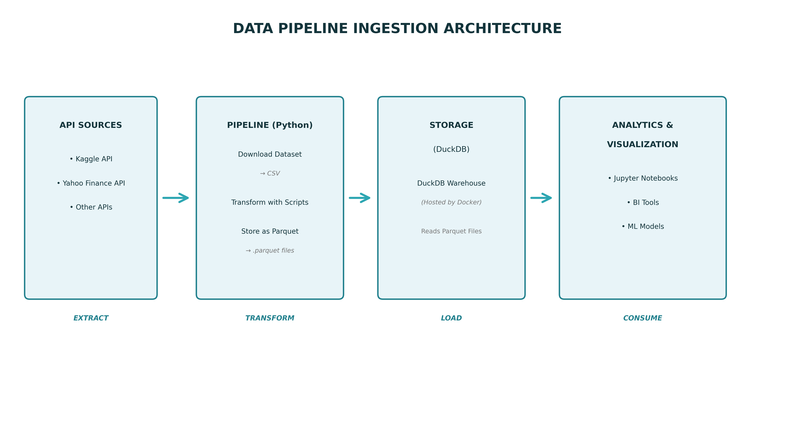

# Data Pipeline Ingestion Architecture

A comprehensive overview of our data ingestion and processing pipeline from API sources to cloud storage.

---

## Pipeline Architecture Diagram



---

## Pipeline Flow Overview

```

API Sources → Pipeline (Python) → Storage (DuckDB) → Analytics & Visualization

```

---

## 1. API Sources

External data sources accessed via APIs:

- **Kaggle API**
  - Dataset downloads and access
  - Automated data retrieval

- **Yahoo Finance API**
  - Financial market data
  - Stock prices and indicators

- **Other APIs**
  - Additional third-party data sources
  - Custom integrations

---

## 2. Pipeline (Python)

Data processing and transformation layer:

### Download Dataset → CSV
- Initial data extraction from APIs
- Raw CSV format storage
- Temporary staging layer

### Transform with Scripts
- Data cleaning and validation
- Business logic application
- Data type conversions
- Feature engineering

### Store as Parquet
- Convert processed data to Parquet format
- Columnar storage for efficient queries
- Compressed file format
- Ready for warehouse ingestion

---

## 3. Storage (DuckDB)

Containerized data warehouse:

### DuckDB Warehouse
- Hosted by Docker for portability
- Reads Parquet files directly
- In-process analytical database
- OLAP-optimized queries

### Features
- Zero-copy data access from Parquet
- SQL interface for querying
- High-performance analytics
- Lightweight and embeddable
- Easy deployment and scaling

---

## 4. Analytics & Visualization

Data consumption layer:

### Jupyter Notebooks
- Interactive data exploration
- Ad-hoc analysis
- Prototyping and experimentation

### BI Tools
- Dashboards and reports
- Business intelligence
- Data visualization

### ML Models
- Machine learning pipelines
- Predictive analytics
- Model training and inference

---

## Key Benefits

✅ **Automated**: API-driven data ingestion  
✅ **Lightweight**: DuckDB in Docker for easy deployment  
✅ **Efficient**: Parquet format for fast queries  
✅ **Flexible**: Multiple consumption patterns  
✅ **Cost-effective**: Open-source stack with minimal infrastructure

---

## Technology Stack

| Layer | Technologies |
|-------|-------------|
| **Sources** | Kaggle API, Yahoo Finance API, REST APIs |
| **Processing** | Python, Pandas, Data transformation scripts |
| **Storage** | DuckDB (Docker), Parquet files |
| **Analytics** | Jupyter, BI tools, ML frameworks |

---

## Data Flow Details

1. **Extract**: APIs provide raw data downloaded as CSV files
2. **Transform**: Python scripts clean, validate, and transform data
3. **Load**: Transformed data stored as Parquet files, read by DuckDB warehouse
4. **Consume**: Multiple tools connect to DuckDB for analysis

---

## Architecture Highlights

---

### Why DuckDB?
- **Fast**: Optimized for analytical queries on Parquet files
- **Simple**: No separate server process required
- **Portable**: Docker container for consistent deployment
- **Efficient**: Direct Parquet file access without data duplication

---

### Why Parquet?
- **Columnar**: Perfect for analytical workloads
- **Compressed**: Reduces storage costs
- **Schema-aware**: Self-describing format
- **Universal**: Compatible with many tools and frameworks
